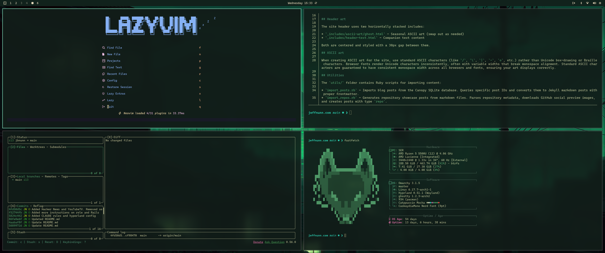
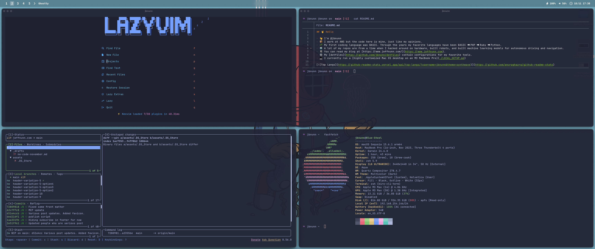

## 🤘🏻 Hello 

- I'm @jbnunn
- My first coding language was BASIC. Through the years my favorite languages have been BASIC ⮕ PHP ⮕ Ruby ⮕ Python. 
- A lot of my repos are from a time when I hacked around on hardware, built robots, and trained machine learning models for autonomous driving and navigation.
- I work at AWS but the code here is mine, just like my opinions.
- You can read my blog at [https://www.jeffnunn.com/](https://www.jeffnunn.com).
- My [dotfiles](https://github.com/jbnunn/dotfiles) contain configurations for my favorite tools.

_A peek into the 90's (circa 1997 or 1998), where I was using MATLAB to write my first neural network for an assignment while at UT Dallas. It would be nearly 20 years before I'd write another one._

## Development setups

I use a Mac for work, but most of my personal dev takes place on a BeeLink Mini PC running Omarchy / Arch Linux.

### 1. My Omarchy/Arch Linux setup

I've moved from Ubuntu to [Omarchy](https://omarchy.org/), an Arch Linux configuration. I run this on my [Beelink SER 5](amazon.com/Beelink-Windows-Display-Output-Computer/dp/B09LV1V5M9) with an AMD Ryzen 5500U. Outside of a few tiny config changes, Omarchy looks like this out of the box.

#### Window management (Omarchy defaults)

- **[Hyprland](https://github.com/hyprwm/Hyprland)** - An amazingly beautiful and configurable dynamic tiling window manager with configurable keybindings that let me use the keyboard to navigate the system, launch anything, and rearrange windows and spaces.
- **[Waybar](https://github.com/Alexays/Waybar)** - Customizable status bar that compliments Hyprland nicely

#### Terminal and shell extras
- **[Ghostty](https://ghostty.org/)** - Fast, GPU-accelerated terminal
- **[Bash](https://en.wikipedia.org/wiki/Bash_Unix_shell)** - I've found on Linux I really don't need zsh. I have everything I need with Bash and Starship.
- **[Starship](https://starship.rs/)** - Minimal, fast prompt
- **[Stow](https://www.gnu.org/software/stow/)** - Dotfile management via symlinks. Allows me to easily share configs across machines.
- **[Yazi](https://github.com/sxyazi/yazi)** - Terminal based file manager with an intuitive interface. 
- ... lots of other goodies thanks to [Omarchy's preinstalled TUIs](https://learn.omacom.io/2/the-omarchy-manual/59/tuis)

#### Keyboard and mouse
- **[LoFree Lite 84 keyboard](https://www.lofree.co/products/flow-lite84-mechanical-keyboard)** - I love this thing. I've been on Apple's Magic Keyboards for too long. This is a treat.
- **[Lofree Touch PBT mouse](https://www.lofree.co/products/lofree-touch-pbt-wireless-mouse?variant=44242527551707)** - This mouse looks like something you'd see on the show Severance. Which is why I bought it.
  
#### Development tools
- **[Neovim](https://neovim.io/)** - Modern, extensible text editor

### 2. My macOS setup

I've customized macOS to feel more like Arch Linux while keeping the benefits of Mac hardware. I run the following on my MacBook Pro M3 Max:

#### Window management
- **[Yabai](https://github.com/koekeishiya/yabai)** - Tiling window manager inspired by [Hyprland](https://wiki.archlinux.org/title/Hyprland)
- **[skhd](https://github.com/jackielii/skhd.zig)** - Hotkey daemon for keyboard-driven workflow (my favorite: `cmd + return` opens a new terminal)
- **[SketchyBar](https://github.com/FelixKratz/SketchyBar)** - Customizable status bar with dynamic system info

#### Terminal and shell
- **[Ghostty](https://ghostty.org/)** - Fast, GPU-accelerated terminal (recently switched from iTerm2). I like the way it handles splits better than iTerm2.
- **[Zsh](https://www.zsh.org/)** - My macOS shell for the past decade
- **[Starship](https://starship.rs/)** - Minimal, fast prompt
- **[LazyGit](https://github.com/jesseduffield/lazygit)** - Terminal UI for Git
- **[FZF](https://github.com/junegunn/fzf)** - Interactive fuzzy finder
- **[Bat](https://github.com/sharkdp/bat)** - Better `cat` with syntax highlighting
- **[Stow](https://www.gnu.org/software/stow/)** - Dotfile management via symlinks. Allows me to easily share configs across machines.
- **[Yazi](https://github.com/sxyazi/yazi)** - Terminal based file manager with an intuitive interface. 

#### Development tools
- **[Neovim](https://neovim.io/)** - Modern, extensible text editor

## Wallpapers

* So many awesome choices at [https://github.com/dharmx/walls](https://github.com/dharmx/walls)

